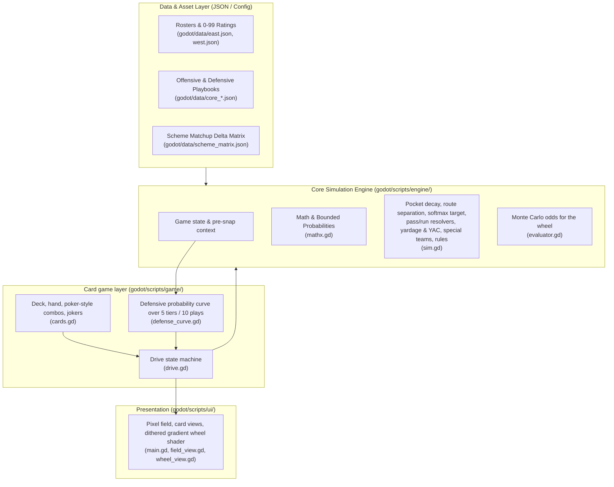
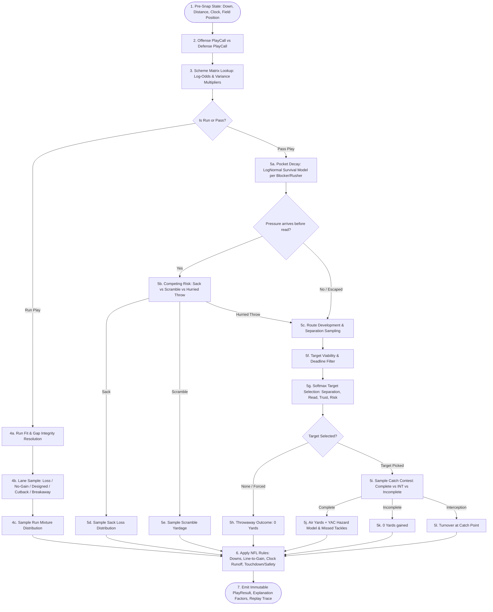

# Tactical Football — Technical Development Document & Architecture Plan

**Document Version:** 1.0.0  
**Runtime:** Godot 4.7 (GDScript). The simulation, game layer and UI all run in-engine, with no server.  
**Note:** this document is the mathematical specification behind the simulation in `godot/scripts/engine/`.  
**Specification Baseline:** Tactical Football GDD v1.0

---

## 1. Executive Summary & Architectural Goals

**Tactical Football** is a turn-based, pure tactical NFL simulation where the player acts as an Offensive Coordinator calling plays against a situational AI Defensive Coordinator. Outcomes are resolved through a mathematically rigorous, explainable, calibrated stochastic engine—free from real-time physics—while strictly preserving NFL down, distance, scoring, possession, clock, and field-boundary rules.

### Core Architecture Tenets
1. **Mathematical Rigor & Calibration:** Probabilities are bounded logistic mappings over standardized ratings ($z \in [-2, 2]$); time-to-pressure uses Log-Normal survival functions; yardage is modeled via discrete/continuous mixtures (TFL, standard gain, heavy-tailed explosives).
2. **Seeded Replayability:** All randomness flows through a seedable `RandomNumberGenerator`, so a drive is reproducible from its seed and the same sequence of card choices (`Drive.new(data, seed)`).
3. **Causal Explainability:** Outcome resolutions emit natural-language explanation lines (e.g., *"Sacked by East Edge #1!"*, *"Ball out before pressure"*), breaking down the causal drivers behind each result.
4. **Data-Driven Content:** Rosters, playbooks, defensive plays and the scheme matrix are plain JSON in `godot/data/`, so content can change without touching code.

---

## 2. System Architecture & Component Diagram



---

## 3. Play Resolution Graph & Mathematical Pipeline



---

## 4. Mathematical Specifications

### 4.1 Rating Normalization & Matchup Log-Odds
Every 0–99 player rating $r$ maps to a zero-centered standardized rating $z(r)$:
$$z(r) = \frac{r - 50}{25}$$

For any single head-to-head interaction (e.g., Blocker vs. Rusher, Receiver vs. Corner):
$$\Delta = w_{\text{off}} z(A_{\text{off}}) - w_{\text{def}} z(A_{\text{def}}) + M_{\text{scheme}} + C_{\text{context}}$$

The bounded probability of offensive win:
$$p_{\text{win}} = \sigma\left(\operatorname{logit}(p_0) + \operatorname{clip}(\Delta, -L, L)\right), \quad \sigma(x) = \frac{1}{1 + e^{-x}}, \quad L = 3.0$$

### 4.2 Pocket Decay & Time-to-Pressure Survival
For each pass blocker $i$ against rusher $j$, time-to-loss follows a Log-Normal survival model:
$$T_{ij} \sim \operatorname{LogNormal}(\mu_{ij}, \sigma_{ij}^2)$$
where $\mu_{ij}$ is calibrated such that $\Pr(T_{ij} \ge 2.5\text{s}) = p_{\text{hold}}$.

Pocket pressure time and QB deadline:
$$T_{\text{pressure}} = \min_{i,j} T_{ij}, \qquad T_{\text{deadline}} = \min(T_{\text{pressure}} + T_{\text{QB escape}}, T_{\text{play cap}})$$

### 4.3 Target Selection (Softmax over Viable Reads)
A receiver $r$ is viable if route development time $t_r \le T_{\text{deadline}}$. For viable targets $V$:
$$q_r = w_s S_r(t) + w_{\text{read}} \left(\frac{1}{\text{read\_order}_r}\right) + w_{\text{trust}} \text{Trust}_r - w_{\text{risk}} \text{Risk}_r$$
$$P(T = r) = \frac{\exp(q_r / \tau)}{\exp(q_{\text{away}} / \tau) + \sum_{k \in V} \exp(q_k / \tau)}$$

### 4.4 Yardage Mixture Distributions
- **Run Plays:** 
  $$Y_{\text{run}} \sim p_{\text{loss}} \cdot \text{DiscreteLoss}(-5, 0) + p_{\text{short}} \cdot \text{ShiftedGamma}(\alpha_1, \beta_1) + p_{\text{exp}} \cdot \text{HeavyTailGamma}(\alpha_2, \beta_2)$$
- **Pass Plays:**
  $$Y_{\text{pass}} = Y_{\text{air}} + Y_{\text{YAC}}, \quad Y_{\text{YAC}} = \min\left(Y_{\text{space}}, Y_{\text{tackle-hazard}}, Y_{\text{field-boundary}}\right)$$

---

## 5. Module & File Organization

```
godot/
├── project.godot
├── data/                           # east.json, west.json, core_offense.json (20 plays), core_defense.json
│                                   # (10 plays, 5 tiers, per-play tilts), scheme_matrix.json
├── assets/                         # VT323 and Press Start 2P fonts (SIL OFL licenses alongside), wheel.gdshader
├── scripts/
│   ├── engine/                     # mathx, sim (resolution graph), evaluator (Monte Carlo), game_data (loader)
│   ├── game/                       # cards (deck, combos, jokers), defense_curve, drive (state machine)
│   └── ui/                         # main, field_view, wheel_view, card_view, px, px_button
├── scenes/main.tscn
└── tests/                          # calib.gd, drive_test.gd, discard_test.gd, autoplay.gd
```

---

## 6. Implementation Milestones & Roadmap

| Milestone | Deliverables | Verification Strategy |
|---|---|---|
| **Phase 1: Math Foundation** | `mathx.gd`, `scheme_matrix.json` | Probability bounds and clipping; inverse-normal and gamma quantile accuracy. |
| **Phase 2: Core Resolution Engine** | `sim.gd` (pocket, routes, target selection, pass/run resolvers, yardage) | `tests/calib.gd` reports mean yards, completion and sack rates per play against each defense; targets are roughly +5.6 for Inside Zone, 78% completion for Slants, and +14 for Four Verticals versus Cover 3. |
| **Phase 3: Rules & Special Teams** | `sim.gd` (rules, special teams) | `tests/drive_test.gd`: 300 random drives, legal downs and possession, scoring distribution. |
| **Phase 4: Data & Defensive Curve** | `data/*.json`, `defense_curve.gd` | Situational sanity (long yardage sits deep, short yardage crowds the line). |
| **Phase 5: Card Game & UI** | `cards.gd`, `drive.gd`, `scripts/ui/*` | `tests/autoplay.gd` and `tests/discard_test.gd` drive the real UI and screenshot it. |
| **Phase 6: Roguelike Loop & Balance** | Opponent rounds, rewards, joker draft, difficulty scaling | Target roughly 2 points per random-play drive; phone export test. |
